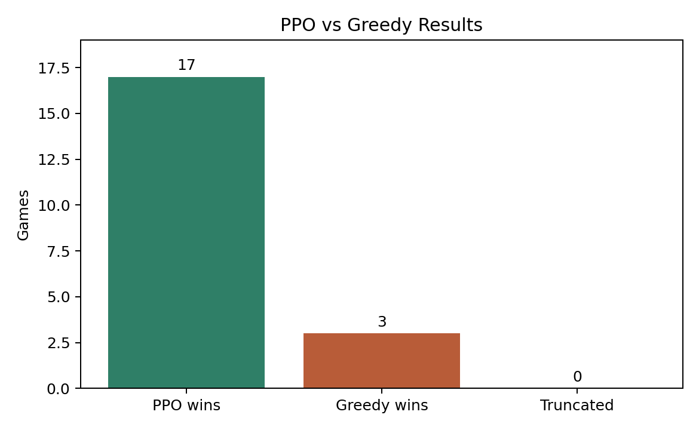
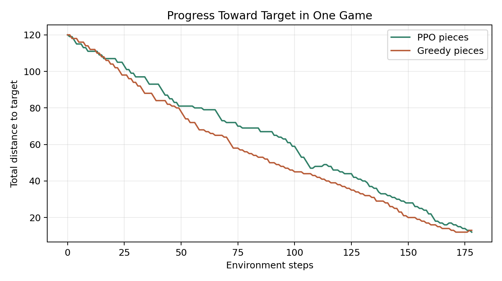
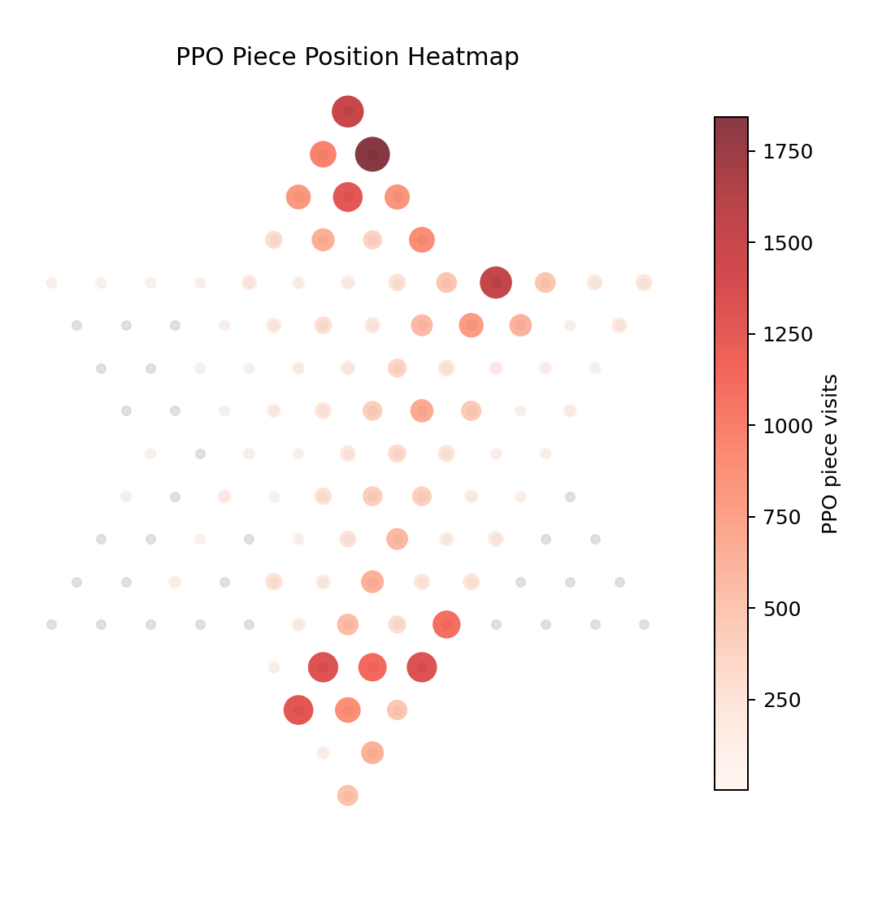
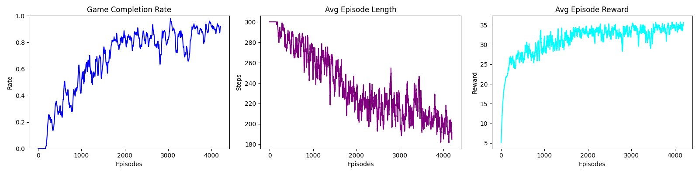
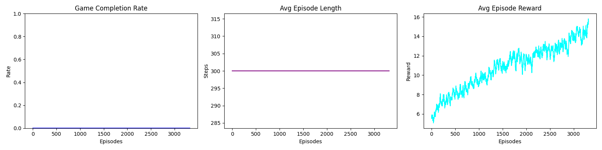

# RL Chinese Checkers

This project explores reinforcement learning for Chinese Checkers. The goal was
to learn how a board game can be turned into a reinforcement learning
environment and how a PPO agent can be trained to play it.

This project was inspired by
[Efficient Learning in Chinese Checkers: Comparing Parameter Sharing in Multi-Agent Reinforcement Learning](https://arxiv.org/abs/2405.18733),
especially its ideas about submoves, action masking, stacked board observations,
PPO, and shared-policy self-play. This repo uses a smaller and simpler setup:
a 1v1 Chinese Checkers agent trained with `MaskablePPO`.

## Project Overview

The final PPO model uses:

- `MaskablePPO` from `sb3-contrib`
- a Gymnasium-style 1v1 Chinese Checkers environment
- submove-based actions
- legal action masking
- a 484-value observation vector
- one shared policy for both players

The main trained model is:

```text
ppo_1mil_1v1.zip
```

## Important Files

```text
PPO/APO_env_v2.py                 Main 1v1 submove environment
PPO/train_submoves_v2_longrun.py  Training script for the submove PPO model
PPO/APO_env_nosub.py              No-submove baseline environment
PPO/APO_train_nosub.py            No-submove baseline training script
PPO/evaluate_ppo_vs_greedy_1v1.py PPO vs greedy benchmark
PPO/plot_ppo_greedy_benchmark.py  Creates benchmark plots
single system/                    Original teacher/game files
```

## Results

The trained PPO model was tested against a greedy baseline for 20 games with a
200-step limit.

| Metric | Result |
|---|---:|
| PPO wins | 17 |
| Greedy wins | 3 |
| Truncated games | 0 |
| Average steps | 167.95 |







## Training Curves

Submove-based PPO training:



No-submove baseline training:



## Running Evaluation

Install dependencies:

```bash
pip install -r requirements.txt
```

Run the PPO vs greedy benchmark:

```bash
python PPO/evaluate_ppo_vs_greedy_1v1.py --model-path ppo_1mil_1v1.zip --games 20 --max-steps 200
```

Generate benchmark plots:

```bash
python PPO/plot_ppo_greedy_benchmark.py --model-path ppo_1mil_1v1.zip --games 20 --max-steps 200
```

## Note

This was made as a learning project. It is not a full research reproduction and
does not include the full six-player multi-agent setup from the paper that
inspired it. The tournament server connection was not completed in time, but the
trained model was later tested manually and verified to run.
